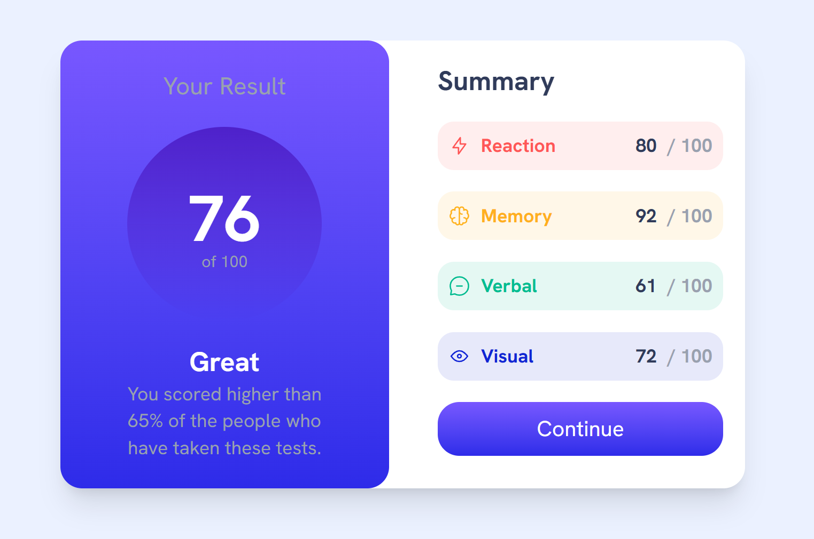

# Frontend Mentor - Results summary component solution

This is a solution to the [Results summary component challenge on Frontend Mentor](https://www.frontendmentor.io/challenges/results-summary-component-CE_K6s0maV). Frontend Mentor challenges help you improve your coding skills by building realistic projects. 

## Table of contents

- [Overview](#overview)
  - [The challenge](#the-challenge)
  - [Screenshot](#screenshot)
  - [Links](#links)
- [My process](#my-process)
  - [Built with](#built-with)
  - [What I learned](#what-i-learned)

## Overview

### The challenge

Users should be able to:

- View the optimal layout for the interface depending on their device's screen size
- See hover and focus states for all interactive elements on the page
- **Bonus**: Use the local JSON data to dynamically populate the content

### Screenshot



### Links

- Solution URL: [https://github.com/hrong1/results-summary-component](https://github.com/hrong1/results-summary-component)
- Live Site URL: [https://hrong1.github.io/results-summary-component/](https://hrong1.github.io/results-summary-component/)

## My process

### Built with

- Semantic HTML5 markup
- CSS custom properties
- Flexbox
- CSS Grid
- Mobile-first workflow
- [React](https://reactjs.org/) - JS library
- [Tailwind](https://tailwindcss.com/)

### What I learned

First time try `tailwindcss`, it is fun to just using the class name for the web styling

```js
<div className="flex items-center justify-center h-screen">
    <div className="bg-white w-fit md:grid md:grid-cols-2 md:rounded-2xl md:max-w-2/4 md:shadow-xl md:gap-5">
        <WebHeader result={Math.round(average)}/>
        <main className="flex flex-col p-4 gap-4">
            <h2 className="text-[hsl(224,30%,27%)] md:text-xl md:font-bold">Summary</h2>
            <div className="flex flex-col gap-4">
                {data.map((item) => {
                    return (
                        <ResultLine key={item.category} data={item}/>
                )})}
            </div>
            <button className="text-white bg-[hsl(224,30%,27%)] rounded-2xl py-2 cursor-pointer hover:bg-linear-to-b from-[hsl(252,100%,67%)] to-[hsl(241,81%,54%)]">Continue</button>
        </main>
    </div>
</div>
```
